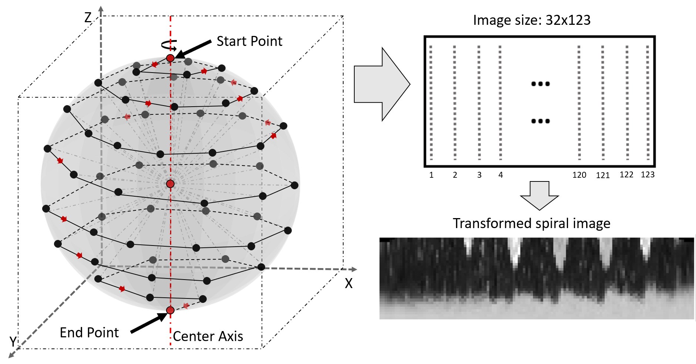
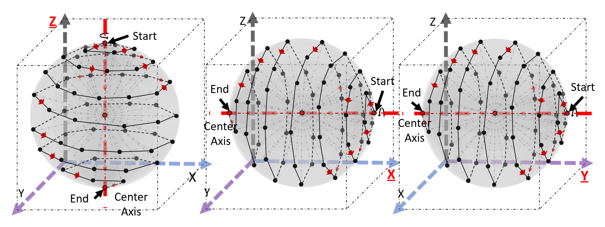
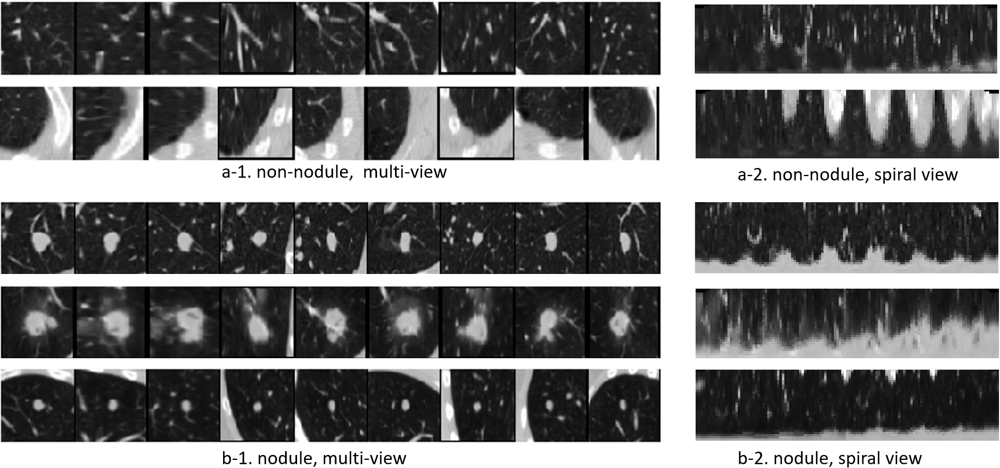

<div align="center">
    
# [2.75D: Boosting learning by representing 3D Medical imaging to 2D features for small data](chrome-extension://efaidnbmnnnibpcajpcglclefindmkaj/https://arxiv.org/pdf/2002.04251)
    
</div>

In medical-data driven learning, 3D convolutional neural networks (CNNs) have started to show
superior performance to 2D CNNs in numerous deep learning tasks, proving the added value of
3D spatial information in feature representation. However, the difficulty in collecting more training
samples to converge, more computational resources and longer execution time make this approach less
applied. Also, applying transfer learning on 3D CNN is challenging due to a lack of publicly available
pre-trained 3D models. To tackle these issues, we proposed a novel 2D strategical representation of
volumetric data, namely 2.75D. In this work, the spatial information of 3D images is captured in a
single 2D view by a spiral-spinning technique. As a result, 2D CNN networks can also be used to
learn volumetric information. Besides, we can fully leverage pre-trained 2D CNNs for downstream
vision problems. We also explore a multi-view 2.75D strategy, 2.75D 3 channels (2.75D×3), to boost
the advantage of 2.75D. We evaluated the proposed methods on three public datasets with different
modalities or organs (Lung CT, Breast MRI, and Prostate MRI), against their 2D, 2.5D, and 3D
counterparts in classification tasks. Results show that the proposed methods significantly outperform
other counterparts when all methods were trained from scratch on the lung dataset. Such performance
gain is more pronounced with transfer learning or in the case of limited training data. Our methods also
achieved comparable performance on other datasets. In addition, our methods achieved a substantial
reduction in time consumption of training and inference compared with the 2.5D or 3D method.


## 2.75D method
Transformation of a 3D volume to 2D representation using spiral scanning. Each dotted line in light grey color
represents a sampled radial line originated from the sphere center to a surface point. 
32 intensity values are on each sampled radial line, which forms one column in the transformed 2D image. 
123 radial lines from top to bottom of the sphere are ordered from left to right in the transformed 2D image.


## 2.75D 3 channels (2.75D×3) method
Three different views for multi-view spiral scanning.


## Examples
Patch examples from 2.5D and the proposed 2.75D in the LIDC-IDRI dataset. Left: nine differently oriented views of
VOIs concatenated (size: 64×(64×9) = 64×576 px); right: extracted spiral view patches of VOIs (size: 32×123 px); a: non-nodule
examples; b: nodule examples



### Core codes:
```python
import math
import random
import numpy as np


def get_slices_from_blob(blob, blob_size):
    number_of_planes = 9
    extracted_planes = np.zeros((blob_size, blob_size, number_of_planes), dtype=blob.dtype)

    # plane 1
    extracted_planes[:, :, 0] = (blob[:, :, blob_size // 2] + blob[:, :, blob_size // 2 + 1]) / 2
    # plane 2
    extracted_planes[:, :, 1] = (blob[:, blob_size // 2, :] + blob[:, blob_size // 2 + 1, :]) / 2
    # plane 3
    extracted_planes[:, :, 2] = (blob[blob_size // 2, :, :] + blob[blob_size // 2 + 1, :, :]) / 2

    # plane 4
    extracted_planes[:, :, 3] = np.diagonal(blob[:, :, :], 0, 0, 1)
    # plane 5
    extracted_planes[:, :, 4] = np.diagonal(blob[:, :, :], 0, 0, 2)
    # plane 6
    extracted_planes[:, :, 5] = np.diagonal(blob[:, :, :], 0, 1, 2)

    # plane 7
    extracted_planes[:, :, 6] = np.diagonal(np.rot90(blob[:, :, :], k=1, axes=(0, 1)), 0, 0, 1)
    # plane 8
    extracted_planes[:, :, 7] = np.diagonal(np.rot90(blob[:, :, :], k=1, axes=(0, 2)), 0, 0, 2)
    # plane 9
    extracted_planes[:, :, 8] = np.diagonal(np.rot90(blob[:, :, :], k=1, axes=(1, 2)), 0, 1, 2)

    return extracted_planes


def convert_to_euclidean_space(blob_radius, inner_radius, alpha, beta):
    # Z is the height; space center is the top left corner of the cubic
    verticle_angle = (math.pi / 2.0) - beta
    inner_radius_XY = inner_radius * math.cos(verticle_angle)
    Z = int(round(blob_radius - inner_radius * math.sin(verticle_angle)))
    X = int(round(blob_radius + inner_radius_XY * math.cos(alpha)))
    Y = int(round(blob_radius + inner_radius_XY * math.sin(alpha)))
    return X, Y, Z


def get_angels(N):
    sphere_step_size = math.pi / float(N)
    # nr_of_points_on_each_circle = 2*N
    alpha_list = []  # horizontal angles, 0-2pi
    beta_list = []  # vitical angles, 0-pi
    alpha_list.append(0)
    beta_list.append(0)

    vertical_beta_step = math.pi / N
    for i in range(0, int(math.ceil(N / 2.0))):
        vertical_beta_on_Ith_circle = (i + 1) * vertical_beta_step
        cos_angel = math.fabs(math.pi / 2 - vertical_beta_on_Ith_circle)
        perimeter = 2 * math.pi * math.cos(cos_angel)
        nr_of_points_on_circle = int(round(perimeter / sphere_step_size))
        for j in range(0, nr_of_points_on_circle):
            alpha_step_size = 2 * math.pi / float(nr_of_points_on_circle)
            beta_step_size_between_circles = vertical_beta_step / float(nr_of_points_on_circle)
            alpha_list.append((j + 1) * alpha_step_size)
            beta_list.append(i * vertical_beta_step + (j + 1) * beta_step_size_between_circles)
    for i in range(int(math.ceil(N / 2.0)), N):
        vertical_beta_on_Ith_circle = i * vertical_beta_step
        cos_angel = math.fabs(math.pi / 2 - vertical_beta_on_Ith_circle)
        perimeter = 2 * math.pi * math.cos(cos_angel)
        nr_of_points_on_circle = int(round(perimeter / sphere_step_size))
        for j in range(0, nr_of_points_on_circle):
            alpha_step_size = 2 * math.pi / float(nr_of_points_on_circle)
            beta_step_size_between_circles = vertical_beta_step / float(nr_of_points_on_circle)
            alpha_list.append((j + 1) * alpha_step_size)
            beta_list.append(i * vertical_beta_step + (j + 1) * beta_step_size_between_circles)
    return alpha_list, beta_list


def get_spiral_image(blob, spiral_image_height):
    blob_size = blob.shape

    if blob_size[0] != blob_size[1] or blob_size[0] != blob_size[2]:
        raise ValueError("input blob is not a cubic!!")

    # Input parameters
    blob_radius = (blob_size[0] - 1) / 2.0
    nr_of_points_on_radius = spiral_image_height  # including the point on the out most sphere 32
    N = 9  # Divide a half circle pi into N parts, meaning the number of horizontal circles, including the other polar point

    alpha_list, beta_list = get_angels(N)
    radius_list = []
    radius_step = blob_radius / float(
        nr_of_points_on_radius)  # number of points on radius should be smaller than radius, since the points will be integer values
    for i in range(nr_of_points_on_radius, 0, -1):
        radius_list.append(i * radius_step)

    spiral_image = np.empty([radius_list.__len__(), alpha_list.__len__(), 1])

    for row_index in range(0, radius_list.__len__()):
        radius_for_the_row = radius_list[row_index]
        for column_index in range(0, alpha_list.__len__()):
            current_alpha = alpha_list[column_index]
            current_beta = beta_list[column_index]
            X, Y, Z = convert_to_euclidean_space(blob_radius, radius_for_the_row, current_alpha, current_beta)

            spiral_image[row_index][column_index][0] = blob[X][Y][Z]

    return spiral_image


def get_spiral_image_3channels(blob, spiral_image_height):
    blob_size = blob.shape

    if blob_size[0] != blob_size[1] or blob_size[0] != blob_size[2]:
        raise ValueError("input blob is not a cubic!!")

    # Input parameters
    blob_radius = (blob_size[0] - 1) / 2.0
    nr_of_points_on_radius = spiral_image_height  # including the point on the out most sphere
    N = 9  # Divide a half circle pi into N parts, meaning the number of horizontal circles, including the other polar point

    alpha_list, beta_list = get_angels(N)
    radius_list = []
    radius_step = blob_radius / float(
        nr_of_points_on_radius)  # number of points on radius should be smaller than radius, since the points will be integer values
    for i in range(nr_of_points_on_radius, 0, -1):
        radius_list.append(i * radius_step)

    spiral_image_3channels = np.empty([radius_list.__len__(), alpha_list.__len__(), 3])

    for row_index in range(0, radius_list.__len__()):
        radius_for_the_row = radius_list[row_index]
        for column_index in range(0, alpha_list.__len__()):
            current_alpha = alpha_list[column_index]
            current_beta = beta_list[column_index]
            X, Y, Z = convert_to_euclidean_space(blob_radius, radius_for_the_row, current_alpha, current_beta)

            spiral_image_3channels[row_index][column_index][0] = blob[X][Y][Z]
            spiral_image_3channels[row_index][column_index][1] = blob[Y][Z][X]
            spiral_image_3channels[row_index][column_index][2] = blob[Z][X][Y]

    return spiral_image_3channels


if __name__ == '__main__':
    # Create a random 64x64x64 blob
    cube_size = 64
    spiral_image_height = 32
    cube = np.random.rand(cube_size, cube_size, cube_size)

    ################################################################
    # 2D method
    img_2d = get_slices_from_blob(cube, cube_size)[:, :, 0]
    # Print the shapes of the extracted images to verify
    print(img_2d.shape)  # Should be (64, 64)
    ################################################################
    # 2.5D method
    img_25d = get_slices_from_blob(cube, cube_size)
    # Print the shapes of the extracted images to verify
    print(img_25d.shape)  # Should be (64, 64, 9)
    ################################################################
    # 2.75D method
    img_275d = get_spiral_image(cube, spiral_image_height).squeeze(2)
    # Print the shapes of the extracted images to verify
    print(img_275d.shape)  # Should be (32, 123)
    ################################################################
    # 2.75D 3channel method
    img_25d3channel = get_spiral_image_3channels(cube, spiral_image_height)
    # Print the shapes of the extracted images to verify
    print(img_25d3channel.shape)  # Should be (32, 123, 3)
    ################################################################
    # 3D method
    img_3d = cube
    # Print the shapes of the extracted images to verify
    print(img_3d.shape)  # Should be (64, 64, 64)
    ################################################################

```

## Citation
If you use this code or models in your scientific work, please cite the following paper:
```bibtex
@article{wang20232,
  title={2.75 D: Boosting learning by representing 3D Medical imaging to 2D features for small data},
  author={Wang, Xin and Su, Ruisheng and Xie, Weiyi and Wang, Wenjin and Xu, Yi and Mann, Ritse and Han, Jungong and Tan, Tao},
  journal={Biomedical Signal Processing and Control},
  volume={84},
  pages={104858},
  year={2023},
  publisher={Elsevier}
}
```

## License
The code is MIT licensed, as found in the [LICENSE file](LICENSE)
